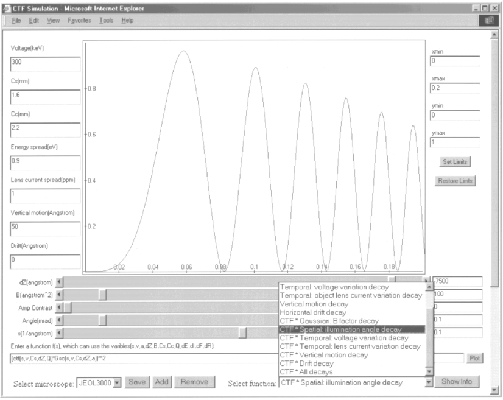

# Java-applet based CTF simulation

This repository archives the Java-applet based CTF simulation website originally hosted by [NCMI](https://ncmi.bcm.edu) and then by the [Jiang lab @ Purdue University](https://jiang.bio.purdue.edu). The applet was created and published in 2001 and many scientistis in the cryo-EM field have been using it to simulate the contrast transfer functions (CTF) of electron microscopes. Unfortunately, modern Web browsers have largely stopped supporting Java applet. We thus archive the Web site here to preserve this small but useful tool that has served the cryo-EM community well for about 20 years.  

W. Jiang and W. Chiu, ["Web-based Simulation for Contrast Transfer Function and Envelope Functions"](https://www.researchgate.net/publication/10890212_Web-based_Simulation_for_Contrast_Transfer_Function_and_Envelope_Functions). Microscopy and Microanalysis 7(4), 329-334, July 2001. [doi: 10.1007/S10005-001-0004-4](https://doi.org/10.1007/S10005-001-0004-4)

